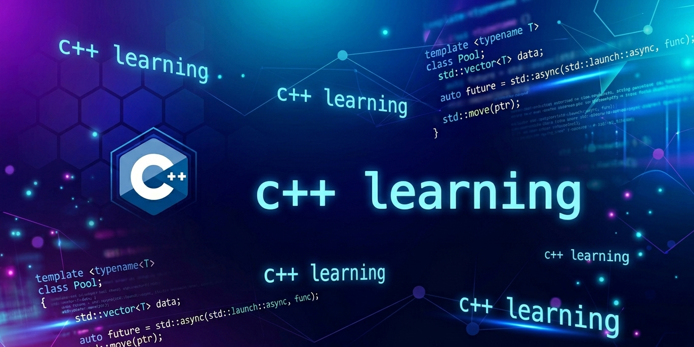

  

# Modern C++ Learning Guide

> A structured, deep-dive reference for developers who want to move beyond surface-level C++ and truly understand the language — from raw memory semantics and template metaprogramming to C++26 reflection, coroutines, and GPU computing.

This guide covers **1166 topics** across **42 categories**, spanning every major revision from C++11 through C++26. Each topic is a standalone Markdown file built around a single focused question, giving you the clarity of a textbook with the precision of a reference manual.

Whether you are preparing for a senior engineering interview, auditing your own knowledge gaps, porting a legacy codebase to modern idioms, or simply curious how the standard library works under the hood — this repository provides a direct path through everything that matters.

### What each topic file contains

- **Full explanation** — the _why_ behind the feature, not just the _what_
- **Worked code examples** — compiling, realistic snippets with commentary
- **Self-assessment questions** with detailed answers and additional examples
- **Personal notes section** — blank space reserved for your own annotations

### How to use this guide

Start anywhere. Jump to a category that matches your current project or study goal, open any topic file, and read straight through. The files are intentionally self-contained — no numbered sequence to follow, no prerequisites to satisfy first. Use the table below as a map, not a syllabus.

## Categories

| # | Category | Topics |
| --- | --- | --- |
| 01 | [Core Language Fundamentals](01_Core_Language_Fundamentals/README.md) | 67 |
| 02 | [Type System & Deduction](02_Type_System_and_Deduction/README.md) | 31 |
| 03 | [Memory & Ownership](03_Memory_and_Ownership/README.md) | 36 |
| 04 | [Move Semantics & Value Categories](04_Move_Semantics_and_Value_Categories/README.md) | 22 |
| 05 | [Templates & Generic Programming](05_Templates_and_Generic_Programming/README.md) | 38 |
| 06 | [Compile-Time Programming](06_Compile_Time_Programming/README.md) | 29 |
| 07 | [Standard Library — Containers](07_Standard_Library_Containers/README.md) | 32 |
| 08 | [Standard Library — Algorithms](08_Standard_Library_Algorithms/README.md) | 39 |
| 09 | [Standard Library — Utilities](09_Standard_Library_Utilities/README.md) | 37 |
| 10 | [Concurrency & Parallelism](10_Concurrency_and_Parallelism/README.md) | 48 |
| 11 | [Error Handling](11_Error_Handling/README.md) | 26 |
| 12 | [Modern OOP Patterns](12_Modern_OOP_Patterns/README.md) | 29 |
| 13 | [Lambda & Functional](13_Lambda_and_Functional/README.md) | 21 |
| 14 | [Ranges (C++20)](14_Ranges_Cpp20/README.md) | 24 |
| 15 | [Modules & Build (C++20)](15_Modules_and_Build_Cpp20/README.md) | 14 |
| 16 | [Coroutines (C++20)](16_Coroutines_Cpp20/README.md) | 21 |
| 17 | [Best Practices & Idioms](17_Best_Practices_and_Idioms/README.md) | 55 |
| 18 | [Tooling & Debugging](18_Tooling_and_Debugging/README.md) | 48 |
| 19 | [std::execution & Senders/Receivers](19_Std_Execution_and_Senders_Receivers/README.md) | 36 |
| 20 | [Reflection (C++26)](20_Reflection_Cpp26/README.md) | 22 |
| 21 | [Performance & CPU Architecture](21_Performance_and_CPU_Architecture/README.md) | 39 |
| 22 | [Networking & I/O](22_Networking_and_IO/README.md) | 29 |
| 23 | [Safety & Security](23_Safety_and_Security/README.md) | 26 |
| 24 | [Build Systems & CI](24_Build_Systems_and_CI/README.md) | 24 |
| 25 | [Design Patterns — Modern Takes](25_Design_Patterns_Modern_Takes/README.md) | 25 |
| 26 | [Standard Library — New in C++23/26](26_Standard_Library_New_Cpp23_26/README.md) | 25 |
| 27 | [Testing & Verification](27_Testing_and_Verification/README.md) | 26 |
| 28 | [Interoperability](28_Interoperability/README.md) | 25 |
| 29 | [OOP Design](29_OOP_Design/README.md) | 43 |
| 30 | [Testing in Practice](30_Testing_in_Practice/README.md) | 32 |
| 31 | [Project Architecture](31_Project_Architecture/README.md) | 42 |
| 32 | [AI-Assisted C++ Development](32_AI_Assisted_Development/README.md) | 22 |
| 33 | [Embedded & Constrained Systems](33_Embedded_and_Constrained_Systems/README.md) | 18 |
| 34 | [ABI & Binary Compatibility](34_ABI_and_Binary_Compatibility/README.md) | 10 |
| 35 | [Undefined Behavior Deep Dive](35_Undefined_Behavior_Deep_Dive/README.md) | 14 |
| 36 | [Cross-Platform Development](36_Cross_Platform_Development/README.md) | 14 |
| 37 | [GPU & Heterogeneous Computing](37_GPU_and_Heterogeneous_Computing/README.md) | 13 |
| 38 | [Low Latency & Real-Time C++](38_Low_Latency_and_Real_Time/README.md) | 16 |
| 39 | [Serialization & Data Formats](39_Serialization_and_Data_Formats/README.md) | 12 |
| 40 | [API & Library Design](40_API_and_Library_Design/README.md) | 15 |
| 41 | [Advanced Debugging Techniques](41_Debugging_Advanced_Techniques/README.md) | 12 |
| 42 | [Functional Programming Patterns](42_Functional_Programming_Patterns/README.md) | 9 |

**Total: 1166 topics**
